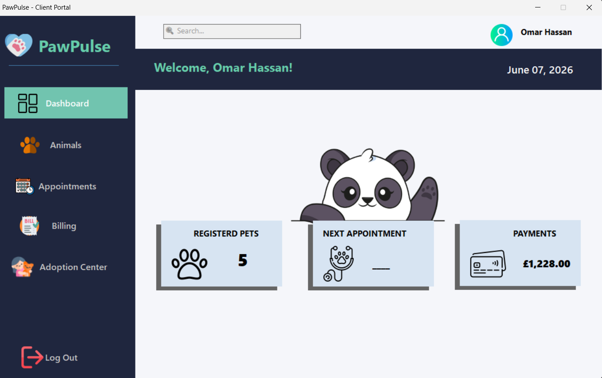
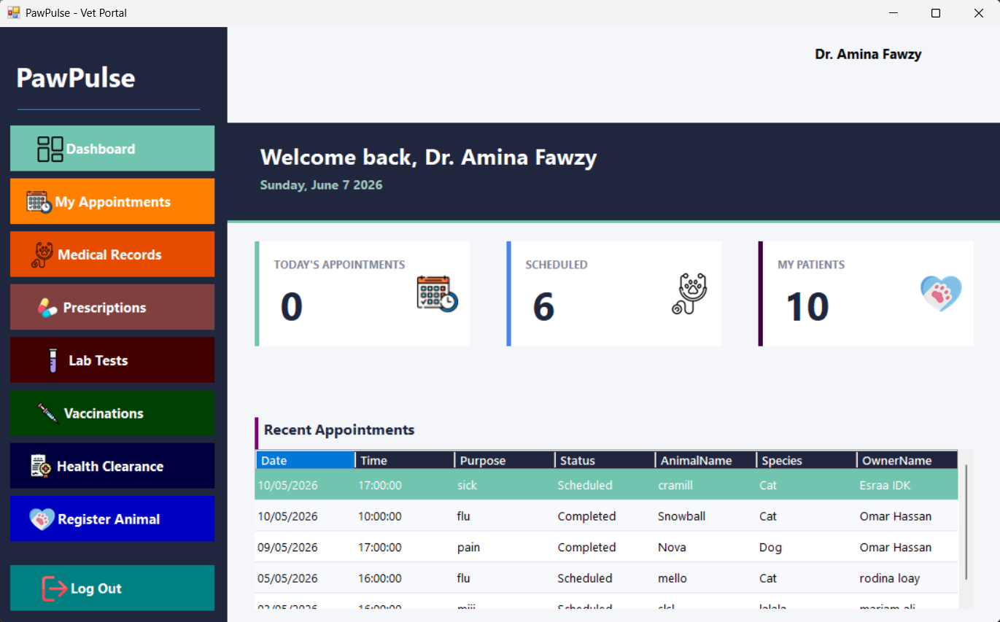
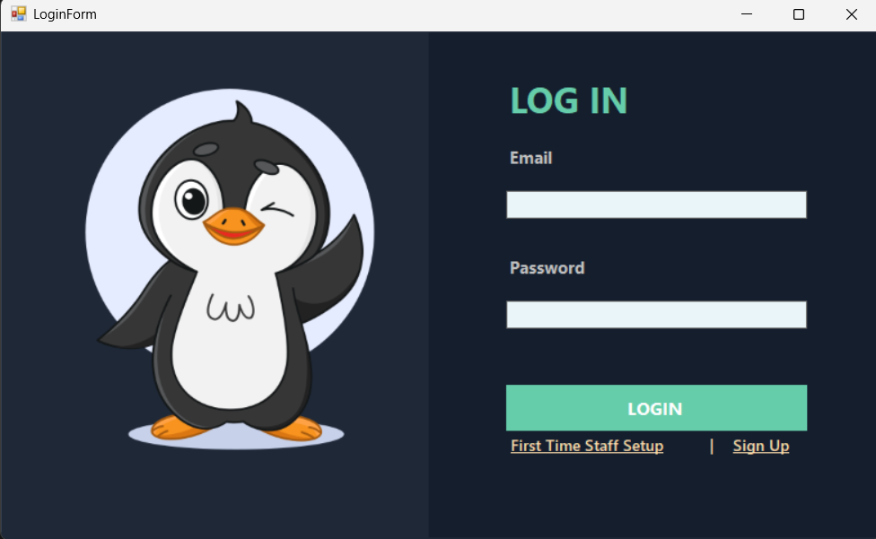
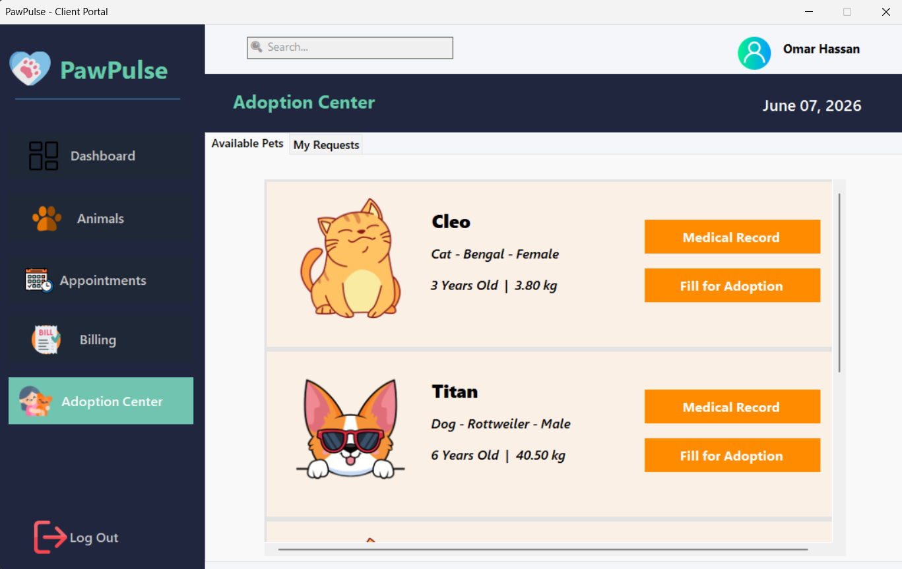

# 🐾 PawPulse: Veterinary Clinic & Shelter Management System


> **Awarded Highest Grade + Bonus Points as a University Capstone/Masterpiece Project.**

PawPulse is a comprehensive, multi-role Windows desktop application designed to seamlessly manage a combined Veterinary Clinic and Animal Shelter. Built entirely from scratch using standard **C# WinForms** (no third-party UI libraries) and powered by a robust **SQL Server** database.

## ✨ Key Features

PawPulse features a secure, role-based architecture serving four distinct user types:

* **🐶 Client Portal:** Clients can register, view their pets' medical history, book vet appointments, view pending bills, and apply for shelter adoptions.
* **🩺 Vet Portal:** Veterinarians can manage their daily schedules, write prescriptions, order lab tests, and issue health clearances for shelter animals.
* **📋 Staff/Shelter Portal:** Staff can process adoption applications, manage kennel availability, register incoming stray animals, and handle daily operational tasks.
* **⚙️ Admin Dashboard:** Complete oversight of the system, including employee management, system analytics, and secure first-time setup protocols.

**Technical Highlights:**
* **Automated Triggers & Stored Procedures:** Complex database logic (like automatically generating bills when lab tests are ordered, or freeing up kennels when adoptions are approved) is handled directly in SQL Server.
* **Secure Authentication:** User passwords are encrypted using **BCrypt** hashing before entering the database.
* **Dynamic UI Validation:** Real-time input handling and database constraint catching to ensure absolute data integrity.

## 🛠️ Tech Stack

* **Frontend:** C# / .NET Windows Forms
* **Backend Logic:** ADO.NET
* **Database:** Microsoft SQL Server (T-SQL, Stored Procedures, Views)
* **Security:** BCrypt.Net

## 📸 System Previews

| Client Dashboard | Vet Portal |
| :---: | :---: |
|  |  |

| LogIN | Adoption Center |
| :---: | :---: |
|  |  |

## 🗄️ Database Architecture

The system utilizes a highly normalized relational database structure designed for scalability and data integrity.


## 🚀 How to Run Locally

1. **Clone the repository:**
   ```bash
   git clone [https://github.com/](https://github.com/)<your-username>/PawPulse.git

2.  **Setup the Database:**
    *   Open Microsoft SQL Server Management Studio (SSMS).
    *   Open the Database/PawPulse_DB.sql script.
    *   Execute the script. It will automatically create the PawPulse database, build all tables, and insert necessary stored procedures.

3.  **Configure the Connection String:**
    *   Open the PawPulse.sln file in Visual Studio.
    *   Navigate to your Database Manager class (DBManager.cs).
    *   Locate the connection string variable at the top of the class. It will look something like this:
        ```bash
        static string DB_Connection_String = @" ";

    *   Replace the string with your local SQL Server details. Usually, it looks like this:
        ```bash
        static string DB_Connection_String = @"Server=YOUR_SERVER_NAME;Database=PawPulse;Trusted_Connection=True;";

    *   (Tip: You can find your exact Server name at the top of the login box when you first open SQL Server Management Studio!)

4.   **Build and Run:**
    *   Press F5 to compile and launch the application!

## 👥 Contributors
    >   A massive thank you to the team who made this masterpiece possible:
            *   Kirolos Ashraf      -   Client Portal
            *   Omar Elkorashy         -   Staff Portal
            *   Youssef Seif        -   veterinarian Portal
            *   Mohamed Gharabawy   -   Admin Portal
